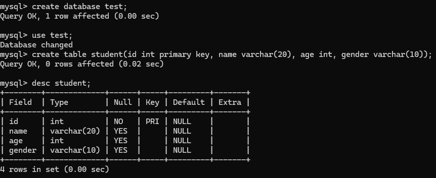

### 实验目的

1. 通过安装某个数据库管理系统，初步了解 DBMS 的运行环境。
2. 了解 DBMS 交互界面、图形界面和系统管理工具的使用。
3. 搭建实验平台。

### 实验平台

- 操作系统：64位Ubuntu 22.04.1
- 数据库管理系统：MySQL 8.0.41-0

### 实验内容和要求

1. 安装 MySQL 8.0.41-0。

    在ubuntu环境下输入`sudo apt install -y mysql-server`实现安装，随后使用`mysql -uroot -p`、`sudo systemctl enable mysql`实现服务启用。

2. 改密码的工作在创建时即完成，这里不赘叙。

3. 创建表

    输入`create database test;`创建库，`use test;`切换至test库，`create table student(id int primary key, name varchar(20), age int, gender varchar(10));`创建表，`desc student;`查看表结构。

    