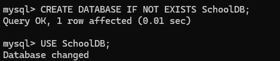
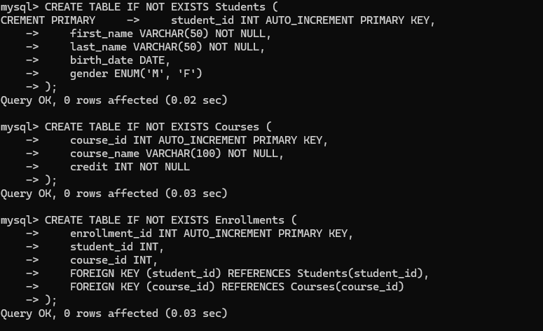
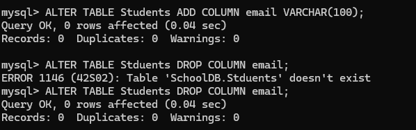
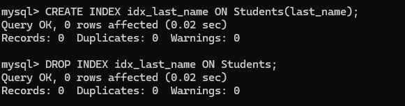
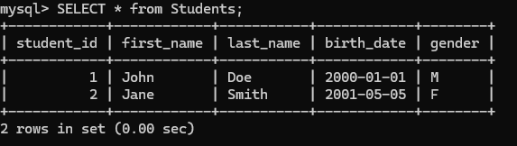
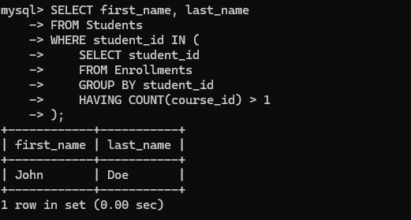
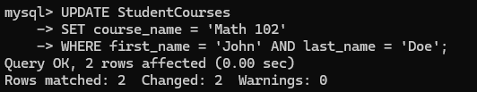

<center><h3>数据库系统原理实验报告</h3></center>

课程名称:数据库系统
专业:竺可桢学院图灵班 计算机科学与技术
学号:3230106221
姓名:吴俊铭

<center><h4>实验 2 SQL 数据定义和操作</h4></center>

##### 实验目的：

1. 掌握关系数据库语言 SQL 的使用。
2. 使所有的 SQL 作业都能上机通过。

##### 实验平台：
1. 数据库管理系统: MySQL

##### 实验内容和要求：

1. 建立数据库。
2. 数据定义： 表的建立/删除/修改; 索引的建立/删除；视图的建立/删除
3. 数据更新： 用 insert/delete/update 命令插入/删除/修改表数据。
4. 数据查询： 单表查询，多表查询， 嵌套子查询等。
5. 视图操作：通过视图的数据查询和数据修改
6. 所有的 SQL 作业都上机通过

##### 实验步骤：

<del>忘记密码费劲千辛万苦终于成功登录.jpg</del>


###### 建立数据库

创建一个新的数据库：

`CREATE DATABASE IF NOT EXISTS SchoolDB;`

使用之：

`USE SchoolDB;`




###### 数据定义：表的建立/删除/修改；索引的建立/删除；视图的建立/删除

创建学生表：

```sql
CREATE TABLE IF NOT EXISTS Students (
    student_id INT AUTO_INCREMENT PRIMARY KEY,  
    first_name VARCHAR(50) NOT NULL,            
    last_name VARCHAR(50) NOT NULL,             
    birth_date DATE,                           
    gender ENUM('M', 'F')                      
);
```

创建课程表：

```sql
CREATE TABLE IF NOT EXISTS Courses (
    course_id INT AUTO_INCREMENT PRIMARY KEY,  
    course_name VARCHAR(100) NOT NULL,          
    credit INT NOT NULL                        
);
```

用于关联学生和课程的选课表：

```sql
CREATE TABLE IF NOT EXISTS Enrollments (
    enrollment_id INT AUTO_INCREMENT PRIMARY KEY,  
    student_id INT,                               
    course_id INT,                                
    FOREIGN KEY (student_id) REFERENCES Students(student_id),  
    FOREIGN KEY (course_id) REFERENCES Courses(course_id)     
);
```



删除表：

```sql
DROP TABLE IF EXISTS Enrollments;

DROP TABLE IF EXISTS Courses;

DROP TABLE IF EXISTS Students;
```

在学生表中插入新字段"邮箱"：

`ALTER TABLE Students ADD COLUMN email VARCHAR(100);`

删除之：

`ALTER TABLE Students DROP COLUMN email;`




<del>请忽略可恶的打错字，谢谢老师</del>

对`last_name`字段建立索引：

`CREATE INDEX idx_last_name ON Students(last_name);`

删除之：

`DROP INDEX idx_last_name ON Students;`



长难句：建立所选课的视图：

```sql
CREATE VIEW StudentCourses AS
SELECT Students.first_name, Students.last_name, Courses.course_name
FROM Students
JOIN Enrollments ON Students.student_id = Enrollments.student_id
JOIN Courses ON Enrollments.course_id = Courses.course_id;
```


###### 数据更新：插入/删除/修改数据

插入数据：

```sql
INSERT INTO Students (first_name, last_name, birth_date, gender)
VALUES ('John', 'Doe', '2000-01-01', 'M'),
       ('Jane', 'Smith', '2001-05-05', 'F');

INSERT INTO Courses (course_name, credit)
VALUES ('Math 101', 3),
       ('History 101', 4);


INSERT INTO Enrollments (student_id, course_id)
VALUES (1, 1),  
       (1, 2),  
       (2, 1);  
```

删除数据：

```sql
DELETE FROM Students WHERE student_id = 1;

DELETE FROM Enrollments WHERE student_id = 2 AND course_id = 1;
```

更新数据：

```sql
UPDATE Students
SET first_name = 'Johnathan'
WHERE student_id = 1;

UPDATE Courses
SET credit = 5
WHERE course_id = 1;
```

###### 数据查询

单表查询：

`SELECT * FROM Students;`



多表查询：

```sql
SELECT Students.first_name, Students.last_name, Courses.course_name
FROM Students, Enrollments, Courses
WHERE Students.student_id = Enrollments.student_id
AND Enrollments.course_id = Courses.course_id;
```

嵌套子查询：

```sql
SELECT first_name, last_name
FROM Students
WHERE student_id IN (
    SELECT student_id
    FROM Enrollments
    GROUP BY student_id
    HAVING COUNT(course_id) > 1
);
```

这查询了选不止一门课的同学的姓名。



通过视图查询：

```sql
SELECT * FROM StudentCourses;
```

通过视图修改：

```sql
UPDATE StudentCourses
SET course_name = 'Math 102'
WHERE first_name = 'John' AND last_name = 'Doe';
```

