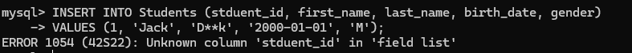
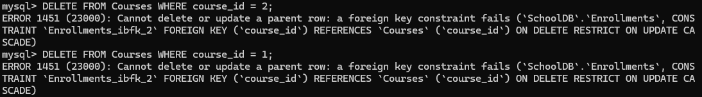
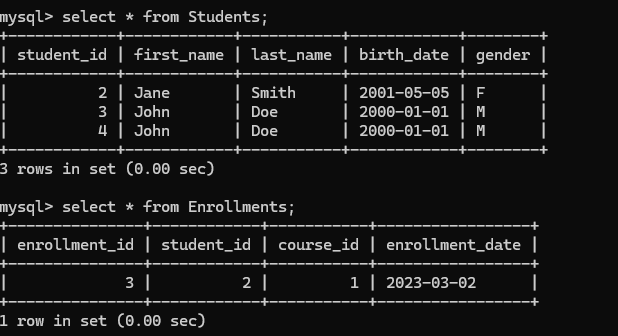
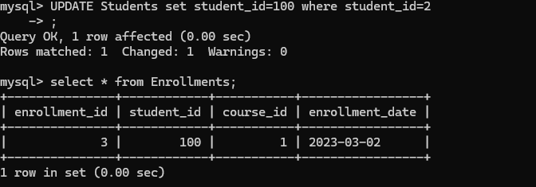
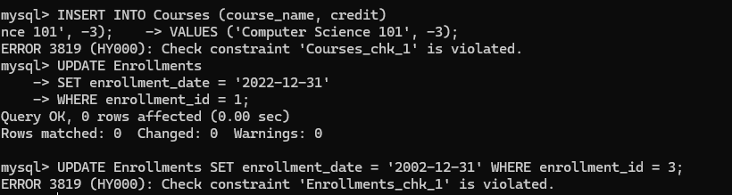
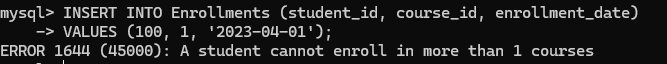

<center><h3>数据库系统原理实验报告</h3></center>

课程名称:数据库系统
专业:竺可桢学院图灵班 计算机科学与技术
学号:3230106221
姓名:吴俊铭

<center><h4>实验 3 SQL数据完整性</h4></center>

##### 实验目的：

1. 熟悉通过 SQL 进行数据完整性控制的方法。

##### 实验平台：

1. 数据库管理系统: MySQL

##### 实验内容和要求：

1. 定义若干表，其中包括 primary key, foreign key 和 check 的定义。
2. 让表中插入数据，考察 primary key 如何控制实体完整性。
3. 删除被引用表中的行，考察 foreign key 中 on delete 子句如何控制参照完整性。
4. 修改被引用表中的行的 primary key，考察 foreign key 中 on update 子句如何控制参照完整性。
5. 修改或插入表中数据，考察 check 子句如何控制校验完整性。
6. 定义一个 assertion, 并通过修改表中数据考察断言如何控制数据完整性。
7. 定义一个 trigger, 并通过修改表中数据考察触发器如何起作用。

##### 实验步骤：

###### 定义若干表，包含 primary key, foreign key 和 check 约束

还是在lab2的基础上。

创建表，这里在lab2的创建代码上添加了`CHECK`逻辑。

```sql
CREATE TABLE IF NOT EXISTS Students (
    student_id INT AUTO_INCREMENT PRIMARY KEY,  
    first_name VARCHAR(50) NOT NULL,            
    last_name VARCHAR(50) NOT NULL,            
    birth_date DATE,                            
    gender ENUM('M', 'F') NOT NULL,            
    CHECK (gender IN ('M', 'F'))           
);

CREATE TABLE IF NOT EXISTS Courses (
    course_id INT AUTO_INCREMENT PRIMARY KEY,  
    course_name VARCHAR(100) NOT NULL,         
    credit INT NOT NULL,                     
    CHECK (credit > 0)                         
);

CREATE TABLE IF NOT EXISTS Enrollments (
    enrollment_id INT AUTO_INCREMENT PRIMARY KEY,  
    student_id INT,                            
    course_id INT,                             
    enrollment_date DATE,                
    FOREIGN KEY (student_id) REFERENCES Students(student_id) ON DELETE CASCADE ON UPDATE CASCADE,  
    FOREIGN KEY (course_id) REFERENCES Courses(course_id) ON DELETE RESTRICT ON UPDATE CASCADE,
    CHECK (enrollment_date >= '2023-01-01')                          
);
```

###### 让表中插入数据，考察 primary key 如何控制实体完整性

```sql
INSERT INTO Students (first_name, last_name, birth_date, gender)
VALUES ('John', 'Doe', '2000-01-01', 'M'),
       ('Jane', 'Smith', '2001-05-05', 'F');
```

```sql
INSERT INTO Courses (course_name, credit)
VALUES ('Math 101', 3),
       ('History 101', 4);
```

```sql
INSERT INTO Enrollments (student_id, course_id, enrollment_date)
VALUES (1, 1, '2023-03-01'),  
       (1, 2, '2023-03-01'),  
       (2, 1, '2023-03-02');  
```

理论上这样的插入会报错，因为主键重复。

```sql
INSERT INTO Students (stduent_id, first_name, last_name, birth_date, gender)
VALUES (1, 'Jack', 'D**k', '2000-01-01', 'M');  
```



###### 删除被引用表中的行，考察 foreign key 中 on delete 子句如何控制参照完整性

以下这两段代码将会报错，因为两门课都被选了。

```sql
DELETE FROM Courses WHERE course_id = 1;

DELETE FROM Courses WHERE course_id = 2;
```



删除了学生，同时选课记录也没惹。

```sql
DELETE FROM Students WHERE student_id = 1;
```



###### 修改被引用表中的行的 primary key，考察 foreign key 中 ON UPDATE 子句

检查`ON UPDATE`子句的同步上传功能。

```sql
UPDATE Students set stduent_id=100 where student_id=2;

select * from Enrollments;
```



###### 修改或插入表中数据，考察 check 子句如何控制校验完整性

```sql
INSERT INTO Courses (course_name, credit)
VALUES ('Computer Science 101', -3);

UPDATE Enrollments
SET enrollment_date = '2002-12-31'
WHERE enrollment_id = 3;
```



也可以发现`0 affected`的优先级高于报错(？)

###### 定义一个 assertion, 并通过修改表中数据考察断言如何控制数据完整性

注意MySQL不支持该语法，但是我们可以通过触发器进行模拟：

```sql
CREATE TABLE IF NOT EXISTS Assertions (
    assertion_name VARCHAR(50),
    check_expr VARCHAR(255)
);

INSERT INTO Assertions (assertion_name, check_expr)
VALUES ('MaxCourses', 'SELECT COUNT(*) <= 3 FROM Enrollments WHERE student_id = 1');
```

###### 

```sql
DELIMITER $$

CREATE TRIGGER check_max_courses
BEFORE INSERT ON Enrollments
FOR EACH ROW
BEGIN
    DECLARE course_count INT;
    
    SELECT COUNT(*) INTO course_count
    FROM Enrollments
    WHERE student_id = NEW.student_id;

    IF course_count >= 1 THEN
        SIGNAL SQLSTATE '45000' SET MESSAGE_TEXT = 'A student cannot enroll in more than 1 courses';
    END IF;
END$$

DELIMITER ;
```

然后验证：

```sql
INSERT INTO Enrollments (student_id, course_id, enrollment_date)
VALUES (100, 1, '2023-04-01');
```

