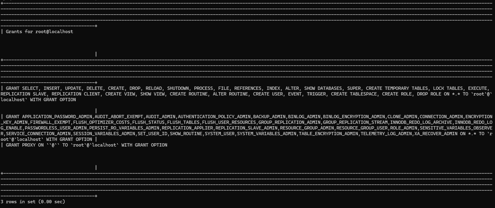
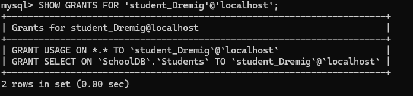
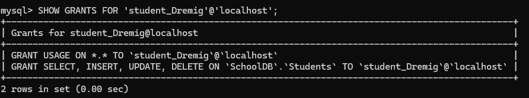
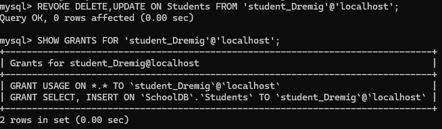
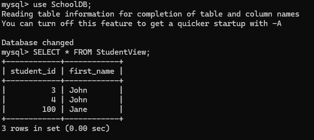
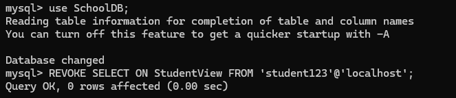
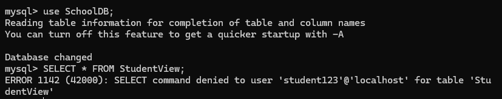

##### 实验步骤

###### 创建表

查看之前创建的表的权限：

```sql
SHOW GRANTS FOR CURRENT_USER;
```



###### 使用 GRANT 和 REVOKE 进行授权和权限回收

创建新的user，并赋予部分权限：


```sql
CREATE USER 'student_Dremig'@'localhost' IDENTIFIED BY 'dremig';

GRANT SELECT ON Students TO 'student_user'@'localhost'; -- 可以查询，其他不太行
```

然后`SHOW GRANTS FOR 'student_Dremig'@'localhost';`查询其权限：



我们先添加select/insert/update/delete权限，然后收回其中几个：





###### 创建视图并授予查询权限

先创建一个视图：

```sql
CREATE VIEW StudentView AS
SELECT student_id, first_name FROM Students;
```

然后授予查询权限：

```sql
GRANT SELECT ON StudentView TO 'student_Dremig'@'localhost';
```

我们登录到`student_Dremig`用户，查询一下：




撤销其权限：

```sql
REVOKE SELECT ON StudentView FROM 'student_Dremig'@'localhost';
```



再去看一眼，权限不够惹。

